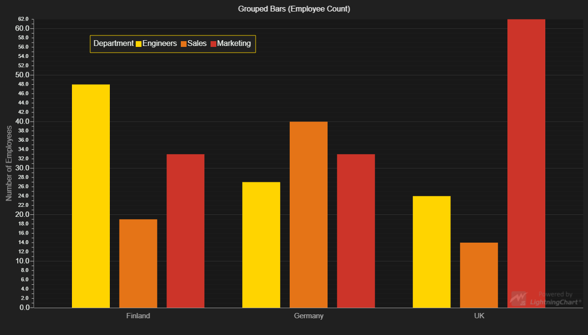

# Grouped Bars



This demo application belongs to the set of examples for LightningChart JS, data visualization library for JavaScript.

LightningChart JS is entirely GPU accelerated and performance optimized charting library for presenting massive amounts of data. It offers an easy way of creating sophisticated and interactive charts and adding them to your website or web application.

The demo can be used as an example or a seed project. Local execution requires the following steps:

- Make sure that relevant version of [Node.js](https://nodejs.org/en/download/) is installed
- Open the project folder in a terminal:

        npm install              # fetches dependencies
        npm start                # builds an application and starts the development server

- The application is available at *http://localhost:8080* in your browser, webpack-dev-server provides hot reload functionality.


## Description

*Also known as Multi-set / Clustered Bar Chart*

This example shows creation of a Grouped Bar Chart made on user side by utilizing RectangleSeries. This is a variation of normal Bar Chart where groups of bars are spaced apart from each other for further categorizing.

Here's the creation of a Grouped Bar Chart using a pre-defined interface.

```javascript
// Create Chart.
const chart = barChart()
// Add groups.
chart.addGroups([
    'Group A',
    'Group B'
])
// Add categories & values.
chart
    .addCategory({
        name: 'Category #1',
        // 'data' contain values for each group in same order as they were defined before.
        data: [100, 200],
        fill: new SolidFill().setColor(prettyColor1)
    })
    .addCategory({
        name: 'Category #2',
        // 'data' contain values for each group in same order as they were defined before.
        data: [50, 160],
        fill: new SolidFill().setColor(prettyColor2)
    })
```

The actual Grouped Bar Chart logic just serves to provide a starting point for users to create their own API based on their needs and preferences.


## API Links

* [XY cartesian chart]
* [Rectangle series]
* [Solid FillStyle]
* [Transparent FillStyle]
* [Empty LineStyle]
* [RGBA color factory]
* [Color palettes]
* [UI elements builders]
* [UI position origins]
* [Rectangle Series]
* [Auto cursor modes]
* [Axis]
* [Scroll strategies]


## Support

If you notice an error in the example code, please open an issue on [GitHub][0] repository of the entire example.

Official [API documentation][1] can be found on [Arction][2] website.

If the docs and other materials do not solve your problem as well as implementation help is needed, ask on [StackOverflow][3] (tagged lightningchart).

If you think you found a bug in the LightningChart JavaScript library, please contact support@arction.com.

Direct developer email support can be purchased through a [Support Plan][4] or by contacting sales@arction.com.

[0]: https://github.com/Arction/
[1]: https://www.arction.com/lightningchart-js-api-documentation/
[2]: https://www.arction.com
[3]: https://stackoverflow.com/questions/tagged/lightningchart
[4]: https://www.arction.com/support-services/

© Arction Ltd 2009-2020. All rights reserved.


[XY cartesian chart]: https://www.arction.com/lightningchart-js-api-documentation/v2.1.0/classes/chartxy.html
[Rectangle series]: https://www.arction.com/lightningchart-js-api-documentation/v2.1.0/classes/rectangleseries.html
[Solid FillStyle]: https://www.arction.com/lightningchart-js-api-documentation/v2.1.0/classes/solidfill.html
[Transparent FillStyle]: https://www.arction.com/lightningchart-js-api-documentation/v2.1.0/globals.html#emptyfill
[Empty LineStyle]: https://www.arction.com/lightningchart-js-api-documentation/v2.1.0/globals.html#emptyline
[RGBA color factory]: https://www.arction.com/lightningchart-js-api-documentation/v2.1.0/globals.html#colorrgba
[Color palettes]: https://www.arction.com/lightningchart-js-api-documentation/v2.1.0/globals.html#colorpalettes
[UI elements builders]: https://www.arction.com/lightningchart-js-api-documentation/v2.1.0/globals.html#uielementbuilders
[UI position origins]: https://www.arction.com/lightningchart-js-api-documentation/v2.1.0/globals.html#uiorigins
[Rectangle Series]: https://www.arction.com/lightningchart-js-api-documentation/v2.1.0/classes/rectangleseries.html
[Auto cursor modes]: https://www.arction.com/lightningchart-js-api-documentation/v2.1.0/enums/autocursormodes.html
[Axis]: https://www.arction.com/lightningchart-js-api-documentation/v2.1.0/classes/axis.html
[Scroll strategies]: https://www.arction.com/lightningchart-js-api-documentation/v2.1.0/globals.html#axisscrollstrategies

